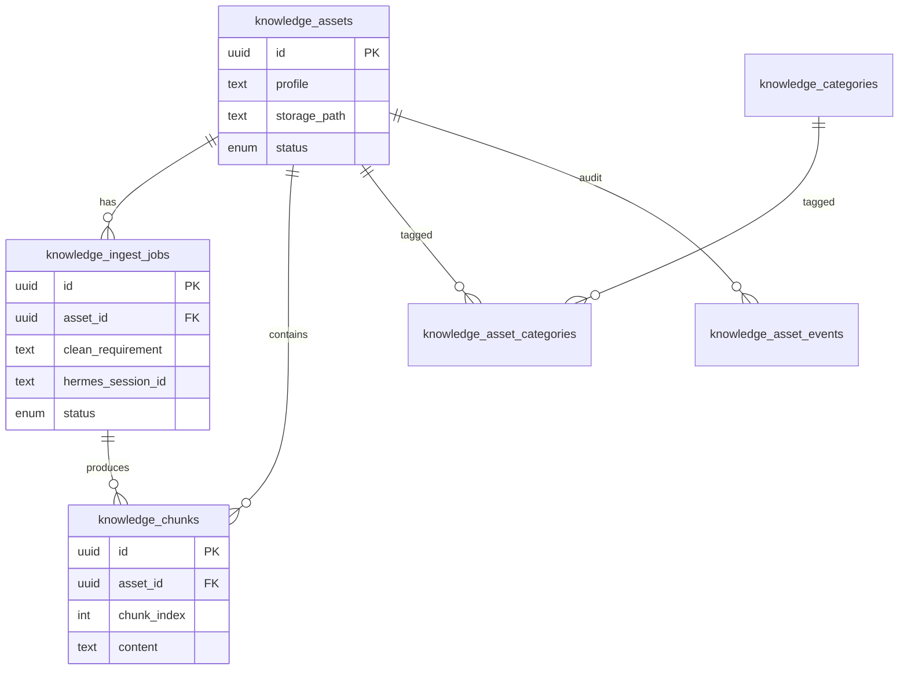
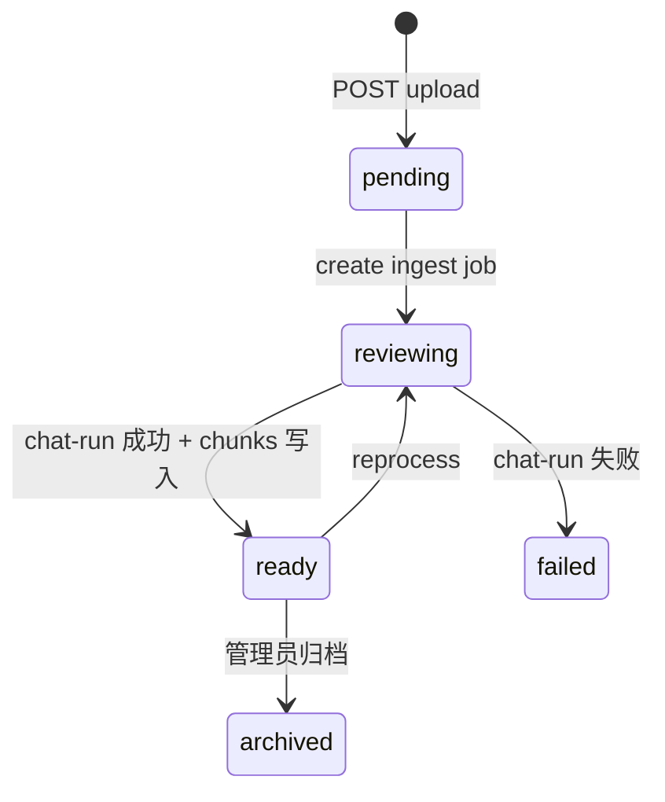

# Presales 知识库 — PostgreSQL 表设计与 Hermes API 对接

售前模块的知识库从浏览器 `localStorage` 迁到 **PostgreSQL**；原始文件落在 **租户对应 Hermes Profile** 的 `knowledge/` 目录，元数据与检索片段存 PG。

租户模型见 [tenant-schema.md](./tenant-schema.md)（**1 租户 = 1 Profile = N 账户**）。

## 部署

Docker Compose 已包含 `postgres` 服务：

```bash
cp .env.example .env
docker compose up -d
```

| 变量 | 默认 | 说明 |
|------|------|------|
| `POSTGRES_USER` | `aipresales` | 数据库用户 |
| `POSTGRES_PASSWORD` | `aipresales` | 密码（生产务必修改） |
| `POSTGRES_DB` | `aipresales` | 库名 |
| `POSTGRES_PORT` | `5432` | 宿主机映射端口 |
| `PG_DATA_DIR` | `./pg_data` | PG 数据卷 |
| `DATABASE_URL` | 见 `.env.example` | Web UI BFF 连接串 |

首次启动时，`packages/server/src/db/postgres/migrations/` 下 SQL 会通过 `docker-entrypoint-initdb.d` 自动建表（`001` 知识库，`002` 租户）。

## ER 关系



## 表说明

### `knowledge_assets` — 文档主表

一条记录 = 用户上传的一个知识文件。

| 字段 | 类型 | 说明 |
|------|------|------|
| `id` | UUID | 主键，前端 `knowledgeRefs` 引用此 ID |
| `tenant_id` | UUID | 所属租户（隔离键） |
| `profile` | TEXT | 冗余：等于 `tenants.hermes_profile_name` |
| `hermes_profile_rel_path` | TEXT | Profile 内相对路径，如 `knowledge/raw/{id}/file.pdf` |
| `hermes_sync_status` | ENUM | 是否已写入 Hermes profile 目录 |
| `uploaded_by_account_id` | UUID | 上传账户（`tenant_accounts.id`） |
| `uploaded_by` | TEXT | 遗留审计字段，可弃用 |
| `original_filename` | TEXT | 原始文件名（UI 列表展示） |
| `file_type` | TEXT | PDF / PPT / Word 等 |
| `storage_path` | TEXT | 磁盘路径，见下方「文件存储」 |
| `checksum_sha256` | TEXT | 去重、校验 |
| `status` | ENUM | `pending` → `reviewing` → `ready` / `failed` |
| `clean_summary` | TEXT | 清洗完成后的一行摘要（列表可选展示） |
| `metadata` | JSONB | 扩展：页数、语言、来源渠道等 |

**与当前 UI 映射**（`KnowledgeFile`）：

| UI 字段 | PG 来源 |
|---------|---------|
| `fileName` | `original_filename` |
| `fileType` | `file_type` |
| `uploadedAt` | `created_at` |
| `status` | `status`（`reviewing` / `ready` / `failed`） |
| `cleanRequirement` | 最新 `knowledge_ingest_jobs.clean_requirement` |
| `eta` | 最新 job 的 `eta_at` |

列表查询可用视图 `v_knowledge_assets_list`。

### `knowledge_ingest_jobs` — 上传工单 / 清洗任务

对应知识库页「提交清洗工单」弹窗。

| 字段 | 说明 |
|------|------|
| `clean_requirement` | 用户填写的清洗要求 |
| `eta_at` | 预计完成时间（默认 upload 后 +48h，或由 Agent 估算） |
| `status` | `queued` → `processing` → `completed` / `failed` |
| `hermes_session_id` | 关联 Hermes `chat-run` 会话（见下文对接） |
| `result_storage_path` | 清洗产物路径（如 `cleaned.md`） |
| `result_preview` | 前几段文本，供后台预览 |

资产 `status` 与 job 联动建议：

1. 创建 upload → `asset.status = reviewing`，`job.status = queued`
2. 开始 Agent 清洗 → `job.status = processing`，写入 `hermes_session_id`
3. 成功 → `job.status = completed`，`asset.status = ready`，写入 chunks
4. 失败 → `job.status = failed`，`asset.status = failed`

### `knowledge_chunks` — 检索片段

清洗完成后切分写入，供内容生成时检索注入 prompt。

| 字段 | 说明 |
|------|------|
| `chunk_index` | 文档内顺序 |
| `heading` | 章节标题 |
| `content` | 片段正文 |
| `token_count` | 估算 token，控制 prompt 预算 |
| `page_from` / `page_to` | PDF 页码（可选） |

已建 GIN 全文索引（`simple` 配置）。中文质量要求高时可后续加 `zhparser` 或 pgvector。

### `knowledge_categories` / `knowledge_asset_categories`

可选分类（产品手册、案例、模板），对应生成方案时的多选知识库。

### `knowledge_asset_events`

审计：upload、status_change、ingest_started、ingest_completed、agent_error。

## 文件存储布局

**文件在 Hermes Profile 内**，不在 Web UI 独立目录：

```text
~/.hermes/profiles/tenant-{slug}/
  knowledge/
    raw/{asset_id}/{original_filename}
    processed/{asset_id}/cleaned.md
```

PG 存 `tenant_id`、`hermes_profile_rel_path`、`hermes_sync_status`。详见 [tenant-schema.md](./tenant-schema.md)。

## BFF API 设计（待实现）

```text
GET    /api/presales/knowledge              # 列表 → v_knowledge_assets_list
GET    /api/presales/knowledge/:id          # 详情 + 最新 job
POST   /api/presales/knowledge/upload       # multipart + cleanRequirement
GET    /api/presales/knowledge/:id/download # 原始文件
POST   /api/presales/knowledge/:id/reprocess
GET    /api/presales/knowledge/:id/chunks   # 检索/debug
```

`POST upload` 流程：

1. 校验 multipart，存盘到 `knowledge/{profile}/raw/{id}/`
2. INSERT `knowledge_assets` + `knowledge_ingest_jobs`
3. INSERT `knowledge_asset_events` (event_type=`upload`)
4. 异步触发 Hermes 清洗（或先入队，worker 消费）

## 与 Hermes API 对接

### 1. 文件上传 — 复用现有能力

| 步骤 | Hermes / Web UI API | 用途 |
|------|---------------------|------|
| 聊天附件 | `POST /upload` | 已有，存 `upload/{profile}/` |
| Profile 工作区 | `POST /api/hermes/files/upload?path=...` | 可选，Agent 工具可读 |
| **Presales BFF** | `POST /api/presales/knowledge/upload` | **推荐**：写 PG + 专用 knowledge 目录 |

Presales 上传应走 BFF，不要只写 Hermes files API（否则没有工单字段）。

参考实现：

- [`packages/server/src/controllers/upload.ts`](../../packages/server/src/controllers/upload.ts)
- [`packages/client/src/api/hermes/files.ts`](../../packages/client/src/api/hermes/files.ts)

### 2. 知识清洗 — `chat-run` + Session

清洗任务通过 **Agent Bridge** 执行，与对话页相同 Socket 通道：

```text
Socket namespace: /chat-run
emit: input, instructions, session_id, profile
listen: reasoning.delta, message.delta, run.end
```

**服务端伪流程**（`packages/server/src/services/presales/knowledge-ingest.ts`）：

```text
1. 创建 Hermes session（或复用 sessions-db）
2. UPDATE knowledge_ingest_jobs SET status=processing, hermes_session_id=...
3. 组装 instructions，例如：

   你是售前知识库清洗助手。请阅读附件/路径中的文档，按以下要求整理：
   - 清洗要求：{clean_requirement}
   - 输出结构化 Markdown，保留章节层级
   - 最后输出 JSON 块：{"summary":"...","sections":[{"title":"...","content":"..."}]}

4. input 使用 ContentBlock[]：
   - text: 任务说明
   - file: { path: storage_path, mime: ... }   # 注意：Agent 侧多为路径引用

5. run 结束后：
   - 解析 assistant 输出 → 写 result_storage_path + knowledge_chunks
   - asset.status = ready, job.status = completed
```

**注意**：[`content-blocks.ts`](../../packages/server/src/services/hermes/run-chat/content-blocks.ts) 中 file 块传给 Agent 时主要是 `[File: path]` 文本。若 Agent 无读文件工具，BFF 应 **先 `readFile` 再拼进 instructions**，或把文件复制到 Hermes profile 工作区供工具读取。

### 3. 内容生成引用知识库

生成方案（`GeneratePlanModal`）选中 `knowledgeRefs[]` 后：

```text
1. SELECT * FROM knowledge_assets WHERE id = ANY($1) AND status = 'ready'
2. SELECT content FROM knowledge_chunks
     WHERE asset_id = ANY($1)
     ORDER BY asset_id, chunk_index
     LIMIT N   -- 或 FTS: WHERE to_tsvector(...) @@ plainto_tsquery(...)
3. 拼接检索片段 + 商机信息 → instructions
4. POST 创建 content_draft（后续表）+ chat-run 生成 HTML
5. draft.session_id = hermes_session_id
```

仅 `status = ready` 的资产可出现在 `KNOWLEDGE_OPTIONS` 下拉中。

### 4. 与 Hermes Memory / Skills 的边界

| Hermes 能力 | 是否用于 Presales 知识库 |
|-------------|-------------------------|
| `GET/POST /api/hermes/memory` | 否 — 仅 MEMORY.md / USER.md |
| `GET /api/hermes/skills` | 可选 — 内置产品 Skill，与用户上传 PDF 互补 |
| SQLite sessions/messages | 是 — 记录清洗/生成 run，通过 `hermes_session_id` 关联 |
| `POST /upload` | 可参考，Presales 用独立目录 + PG |

### 5. 状态机总览



## 实现顺序

| 阶段 | 内容 |
|------|------|
| **Phase 0** ✅ | Docker PG + SQL migration + 本文档 |
| Phase 1 | `packages/server/src/db/postgres/` 连接池 + migrate 脚本 |
| Phase 2 | `/api/presales/knowledge/*` CRUD + 文件落盘 |
| Phase 3 | ingest worker：`chat-run` 清洗 + 写 chunks |
| Phase 4 | 前端 `KnowledgeBaseView` / `GeneratePlanModal` 接 API |
| Phase 5 | （可选）pgvector、`content_drafts` 表 |

## 本地验证 PG

```bash
docker compose up -d postgres
docker compose exec postgres psql -U aipresales -d aipresales -c '\dt'
docker compose exec postgres psql -U aipresales -d aipresales -c '\d knowledge_assets'
```
