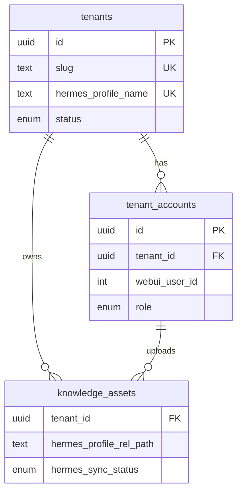
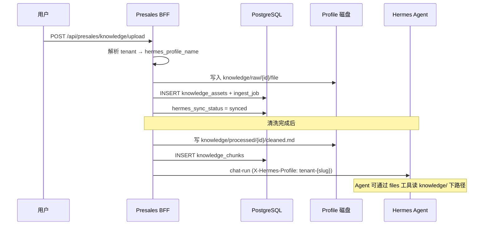

# Presales 租户模型与 Hermes Profile 对应关系

Hermes **没有**原生「租户 / 组织」概念。隔离边界是 **Profile**；Web UI 再通过 SQLite `user_profiles` 控制「哪个登录用户能访问哪些 Profile」。

Presales 在 PostgreSQL 增加 **租户层**，约定：

```text
1 租户 (tenant)  =  1 Hermes Profile  =  1 套 Agent 配置 / 会话 / 技能 / 知识目录
1 租户           →  N 个账户 (tenant_accounts，对应 Web UI 登录用户)
```

---

## Hermes 现有模型（对照）

| 概念 | 存储位置 | 说明 |
|------|----------|------|
| **Profile** | `~/.hermes/` 或 `~/.hermes/profiles/{name}/` | Agent 配置、`.env`、`skills/`、会话等 |
| **Web UI 用户** | SQLite `users` | 用户名密码、`super_admin` / `admin` |
| **用户 ↔ Profile** | SQLite `user_profiles` | 多对多；非 super_admin 只能访问被授权的 profile |
| **请求上下文 Profile** | HTTP 头 `X-Hermes-Profile` | 单次请求使用的 profile |
| **Kanban tenant** | Hermes CLI 任务字段 | 仅是看板任务标签，**不是**多租户 |

相关代码：

- Profile 目录：[`packages/server/src/services/hermes/hermes-profile.ts`](../../packages/server/src/services/hermes/hermes-profile.ts)
- 用户授权：[`packages/server/src/db/hermes/users-store.ts`](../../packages/server/src/db/hermes/users-store.ts) 的 `user_profiles`
- Profile 列表过滤：[`packages/server/src/controllers/hermes/profiles.ts`](../../packages/server/src/controllers/hermes/profiles.ts) 的 `filterProfilesForUser`

---

## PostgreSQL 租户表

Migration：[`002_presales_tenants.sql`](../../packages/server/src/db/postgres/migrations/002_presales_tenants.sql)



### `tenants`

| 字段 | 说明 |
|------|------|
| `name` | 租户显示名（公司名） |
| `slug` | URL 安全标识，如 `jingdigital` |
| `hermes_profile_name` | **与 Hermes 1:1**，如 `tenant-jingdigital` |
| `status` | `provisioning` → `active` / `suspended` / `archived` |
| `settings` | 配额、功能开关等 JSON |
| `provisioned_at` | Hermes profile 创建完成时间 |

**命名建议**：每个租户使用**独立 named profile**，不要用共享的 `default`，避免多租户混用 Agent 状态。

```text
hermes_profile_name = tenant-{slug}
磁盘路径            = ~/.hermes/profiles/tenant-{slug}/
```

### `tenant_accounts`

| 字段 | 说明 |
|------|------|
| `tenant_id` | 所属租户 |
| `webui_user_id` | 对应 SQLite `users.id`（跨库引用，应用层保证） |
| `username` | 冗余字段，便于 PG 查询 |
| `role` | `owner` / `admin` / `member` |
| `status` | `active` / `invited` / `disabled` |
| `is_tenant_owner` | 创建租户的人 |

一个 Web UI 用户理论上可属于多个租户（多行 `tenant_accounts`），登录后选择当前租户，请求带 `X-Tenant-Id`（后续 BFF 实现）。

### `tenant_account_sessions`（可选）

记录用户在某租户下的会话上下文（与 Web UI auth token 可分离，Phase 2+）。

---

## 租户开通时与 Hermes 的同步

创建租户时 BFF 应执行（尚未实现，设计如下）：

```text
1. INSERT tenants (status = provisioning, hermes_profile_name = tenant-{slug})
2. hermes profile create tenant-{slug}   # 或 clone 模板 profile
3. 写入 profile 下 knowledge/ 目录结构
4. INSERT tenant_accounts (owner, webui_user_id = 当前用户)
5. SQLite: replaceUserProfiles(userId, [hermes_profile_name], default)
6. UPDATE tenants SET status = active, provisioned_at = now()
```

删除/归档租户时：

- PG：`tenants.status = archived`
- Hermes：可选保留 profile 目录（合规）或 `hermes profile delete`（需确认无共享依赖）

**super_admin**：仍可访问所有 Hermes profile；Presales BFF 需额外校验 `tenant_accounts` 或放行超管。

---

## 知识库如何「塞进 Profile」

知识库元数据在 **PostgreSQL**；**物理文件**在 **Hermes Profile 目录**内，Agent 与 Files API 才能直接读到。

### 目录约定（相对 profile 根目录）

Hermes Files API 的根目录即 profile home（见 `resolveHermesPath`）：

```text
~/.hermes/profiles/tenant-{slug}/
  knowledge/
    raw/{asset_id}/{original_filename}       # 上传原始文件
    processed/{asset_id}/cleaned.md          # 清洗结果
    processed/{asset_id}/manifest.json       # 可选：chunks 摘要
  skills/                                    # 可选：把稳定知识沉淀为 Skill
```

### PG 字段对应

| 字段 | 含义 |
|------|------|
| `knowledge_assets.tenant_id` | 归属租户 |
| `knowledge_assets.profile` | 冗余 Hermes profile 名（与 `tenants.hermes_profile_name` 一致，便于旧查询） |
| `knowledge_assets.storage_path` | 上传 staging 绝对路径（写入 profile 前） |
| `knowledge_assets.hermes_profile_rel_path` | 如 `knowledge/raw/{uuid}/手册.pdf` |
| `knowledge_assets.hermes_sync_status` | `pending` → `synced` / `failed` |
| `knowledge_assets.uploaded_by_account_id` | 上传人 |

### 上传 + 同步流程



**写入 Profile 的两种方式**（实现时二选一或组合）：

| 方式 | API / 路径 | 适用 |
|------|------------|------|
| **直接写盘** | `getProfileDir(name) + '/knowledge/...'` | 上传、清洗落盘（推荐） |
| **Hermes Files API** | `POST /api/hermes/files/upload?path=knowledge/raw/...` + `X-Hermes-Profile` | 与 UI 文件浏览器一致 |

清洗完成后若希望 Agent **按需加载**，可把 `cleaned.md` 同步到 `skills/presales-kb/{asset_id}/SKILL.md`（复用现有 [`/api/hermes/skills`](../../packages/server/src/controllers/hermes/skills.ts)）。

---

## 与现有 `001` 知识库表的关系

`001_presales_knowledge.sql` 使用 `profile TEXT` 做隔离；`002` 增加 `tenant_id` 为主隔离键，并更新视图 `v_knowledge_assets_list` 通过 JOIN `tenants` 输出 `profile` 字段。

新数据规则：

- `tenant_id` **必填**（应用层校验）
- `profile` 列保留，写入时同步为 `tenants.hermes_profile_name`
- 列表/检索按 `tenant_id` 过滤，不按用户随意切换 profile

---

## 已有 Docker 卷如何升级

`docker-entrypoint-initdb.d` 仅在 **首次** 初始化 PG 数据卷时执行。若本地已有 `./pg_data`：

```bash
# 方式 A：仅执行新 migration
docker compose exec -T postgres psql -U aipresales -d aipresales \
  -f /docker-entrypoint-initdb.d/002_presales_tenants.sql

# 方式 B：清空重建（开发环境）
docker compose down
rm -rf ./pg_data
docker compose up -d postgres
```

---

## 后续 BFF 接口（规划，暂不实现）

```text
POST   /api/presales/tenants              # 创建租户 + provision Hermes profile
GET    /api/presales/tenants              # 当前用户可见租户
POST   /api/presales/tenants/:id/accounts # 租户内添加账户
GET    /api/presales/tenants/:id/knowledge
POST   /api/presales/tenants/:id/knowledge/upload
```

请求头约定：

```text
X-Tenant-Id: {tenant_uuid}           # Presales 业务租户
X-Hermes-Profile: tenant-{slug}      # 与 tenants.hermes_profile_name 一致
```

---

## 小结

| 问题 | 答案 |
|------|------|
| Hermes 有租户吗？ | **没有**；只有 Profile + Web UI 用户授权 |
| 怎么对应？ | PG `tenants.hermes_profile_name` ↔ Hermes profile 目录 |
| 多账户？ | PG `tenant_accounts`，多条记录同一 `tenant_id`，链 SQLite `users.id` |
| 知识库放哪？ | Profile 内 `knowledge/`；PG 存元数据 + `hermes_profile_rel_path` |
| Agent 怎么用？ | 请求带对应 profile；读 `knowledge/` 或 Skill；`chat-run` 清洗/生成 |

更细的知识库字段见 [knowledge-base-schema.md](./knowledge-base-schema.md)。
